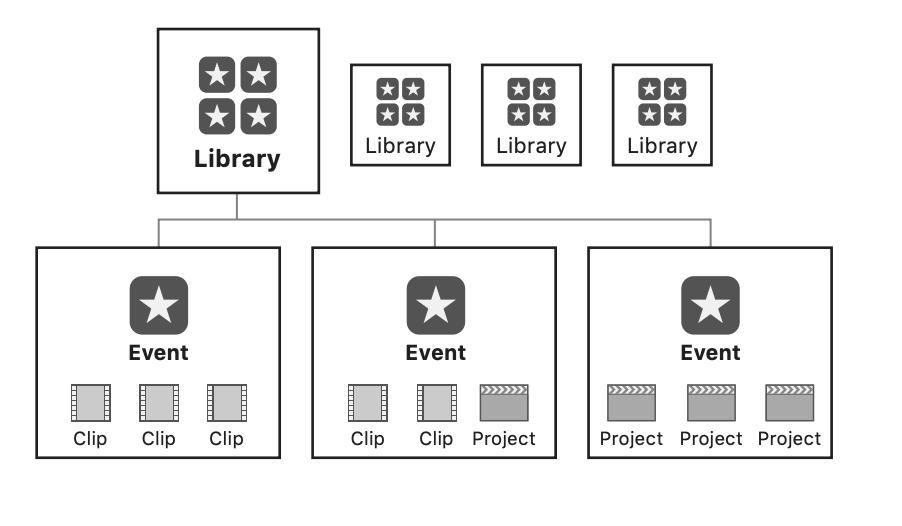
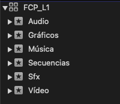

## Organización

Final cut pro utilica librerías para organizar sus archivos. En este diagrama se muestra de manera bastante gráfica. Cada biblioteca debe tener mínimo un evento.
Y dentro de cada evento guardamos clips y proyectos. Los clips pueden ordenarse no solo por nombre, si no también por palabra clave o colecciones inteligentes.

Todo los archivos de renderizado interno e información suelen estar contenido detro de estas librerías. El directorio predeterminado donde macOS guarda estas librerías es el de `/Users/$USER/Vídeos` (a.k.a. la carpeta de Vídeos en el Finder).

Mi recomendación para organizar mejor archivos es hacer una "biblioteca plantilla" que se puede quedar en el directorio de `Vídeos` o `Documentos` con la siguiente estructura.
Con esta manera de organizar, siempre tendrás tus eventos creados por defecto para que no haya necesidad de crearlos una y otra vez. Luego solo tienes que duplicar la biblioteca a tu ubicación de destino
y cambiarle el nombre.

Para mi, los archivos deberían de organizarse dentro del editor. El Finder debería tener la estructura de carpetas mínima y necesaria por si acaso. Pero la administración total de los datos
debe estar hecha dentro de Final Cut. Todo esto que estoy diciendo ahora también es "practicamente" aplicable a DaVinci u otros editores. Es solo una manera de hacerlo, no la manera definitiva.Si quieres saber más sobre la estructura de carpetas y organización puedes visitar mi artículo sobre el [atajo](https://castro.eus/experiments/magic-folders).

Predico mucho que invertir tiempo en [organizar]() ahorra tiempo a la larga. Una vez dentro del editor, recomendiendo usar las siguiente funciones para agilizar el proceso. Todas ellas basadas en [este vídeo](https://vimeo.com/194855528)
de [Thomas Grove Carter](https://thomasgrovecarter.com/) que, si te gusta este programa, me parece obligatorio que veas.
- Aprende [atajos](https://support.apple.com/es-es/guide/final-cut-pro/ver90ba5929/mac), es vital. Los que más uso son:
  - Ripple Trim = `Option + [`
  - [Ajustar el punto de conexión de un clip conectado](https://support.apple.com/es-es/guide/final-cut-pro/ver7a77ef9e/mac)*
  - Mostrar/Ocultar ondas = `^ Control + ⌥ Option + ↑/↓ `
  - Zoom in/out en el timeline = `⌘ + ' y ⌘ + ¡`
  - Zoom out para ver todo el timeline a la vez = `Shift ⇧ + Z`
- Desactiva los paneles que no estés usando con los botones arriba a la derecha.
  - Para organizar, tener el timeline desactivado brinda más espacio para visualizar con más comodidad. Desactivar el inspector también es recomendable. Puedes usar
los atajos  `⌘ + ⌃ + 1` ,  `⌘ + ⌃ + 2` ... para desactivar o activar paneles.
- Utiliza *Favoritos* y *Rechazados* para eliminar metraje innecesario. Aquí una [guía de apple](https://support.apple.com/es-es/guide/final-cut-pro/ver30ccd91f/mac).
- Utiliza [roles de audio](https://www.apple.com/final-cut-pro/docs/Audio_Roles.pdf) para organizar mejor tus clips. Tanto en el explorador como en la línea de tiempo.
- Si tienes escenas marcadas (como en un corto), [ordena las escenas](https://www.youtube.com/watch?v=X9OoZAlNkXo) con metadatos de la cámara o manualmente. Puedes introducir tú el número de toma y escena y luego renombrarlo automáticamente. Todo esto luego es visible en el índice de la línea de tiempo.
- Utiliza [palabras clave](https://support.apple.com/es-es/guide/final-cut-pro/ver68416335/mac) para organizar tus clips

## Ajustes que cambiar

Por defecto, FCPX copia los archivos dentro de la propia biblioteca. Duplicando así, todos los archivos importados. Si tenemos 10GB de vídeo grabados, acabámos con 20GB más los archivos renderizados. Es importante marcas las casilla "Dejar archivos en su posición" en el menú de ajustes. Ese ajuste se encuentra en preferencias de Final Cut Pro (⌘ + ,) y dentro del apartado "Importación".

También está activado por defecto el renderizado en segundo plano. Si tienes un Mac con chip M1 o superior, puedes desactivar esta opción a no ser que estés editando archivos muy comprimidos que dificulten el proceso de edición.
Es coveniente editar con archivos [Prores](https://support.apple.com/es-es/102207), a ser posible. O transcodificar u hacer proxies con [Compressor](https://www.apple.com/es/final-cut-pro/compressor/).

## Eliminar archivos caché

Si hay bibliotecas en las que se nos ha olvidad cambiar los ajustes anteriores, esta es la manera de reclamar ese espacio usado.

1. Click derecho en la biblioteca dentro del Finder
2. Click en "Mostrar contenido del paquete"
3. Nos metemos en la carpeta del evento que más ocupe
4. Borramos los archivos
5. Y después en Final Cut para volver a enlazarlos --> Archivo > Volver a enlazar Archivos

Nos pedirá el sitio donde queramos enlanzarlo. Le señalamos nuestra carpeta y los volverá a sincrozinar.

A veces, aunque hayamos desactivado todo lo previo, se van acumulando archivos de estabilización o de slow-motion que ocupan espacio. Una vez terminado el proyecto podemos eliminarlos de la siguiente manera.

1. Archivo > Eliminar archivos de la biblioteca generados
2. Y marcamos las 3 casillas

- Aquí unos cuantos recursos para leer/ver más y citar las fuentes
  - [Manage Media with Final Cut Pro Libraries (apple.com)](https://www.apple.com/final-cut-pro/docs/Media_Management.pdf)
  - [Final Cut Pro Voice Isolation Audio Noise Reduction - YouTube](https://www.youtube.com/watch?v=fjUG1t42mB8)
  - [Thomas Grove Carter - YouTube](https://www.youtube.com/@ThomasGroveCarter/videos)
  - [Final Cut Pro - Ecosistema - Apple (ES)](https://www.apple.com/es/final-cut-pro/resources/ecosystem/)
