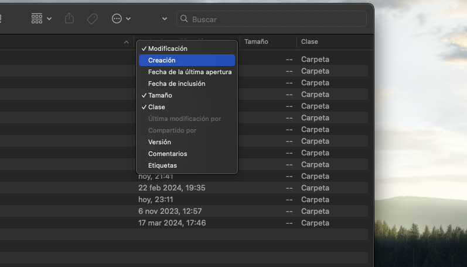

OrganizArt es un conjunto de atajos, scripts y procesos para macOS que automatizan la creación, organización y mantenimiento de árboles de carpetas. 

Este grupo de programas se centra en dos características: la rapidez y la vagancia. Y usa dos programas principales para su uso: [Apple Shortcuts](https://support.apple.com/es-es/guide/shortcuts/welcome/ios) y [Automator](https://support.apple.com/es-es/guide/automator/welcome/mac). 

Este script sigue la filosofía de orden que expongo en [“Organizar es el 90% del trabajo”](https://castro.eus/blog/organizar). Usando el Finder como una base simple y sólida para luego importar y refinar el orden **dentro** del editor de vídeo. Este es el árbol de carpetas base que crea: 

  ```markdown
Proyecto/
├── _Final/
├── Documentos/
├── Media/
│   ├── Audio/
│   ├── Gráficos/
│   │   └── Tipografías/
│   └── Video/
│       └── _Caché/
```

Me gustas las nomenclaturas simples. Ayudan a ser más legibles y, junto a 3 niveles máximos de carpetas, creo que es práctico y suficiente. *Shortcuts* solo pide la ubicación y el nombre de la carpeta crea. Aquí un ejemplo rápido:

<video autoplay muted loop><source src="/videos/OArt1-1.mp4" type="video/mp4"></source></video>

Algo que suele ser bastante común es querer encontrar una carpeta con una fecha específica. Dentro de Finder, puedes hacer click derecho en la barra de filtros y activar el de "Creación". Con esto, podrás ordenar las carpetas por orden de cuándo se crearon primero.



La  última pieza son los Folder Actions. Son una utilidad dentro de macOS adjunta al programa Automator. Cuando introduces en la carpeta nuevos archivos, los organiza automáticamente. Usando como base, el árbol de carpetas que ya hemos creado.

<video style="" autoplay muted loop><source src="/videos/OArt2-1.mp4" type="video/mp4"></source></video>

Esta es la base que uso yo y es una utilidad que nace de necesidad propia. No va dirigida para nadie más para quien la quiera usar. Es gratis y de código abierto y totalmente editable si sabes lo que haces y no estás contento con la estructura base. Puedes consultar el [GitHub](https://github.com/43hershel/OrganizArt/) para más información. 

Se acabaron las carpetas desorganizadas. Llegaron las carpetas inteligentes.
